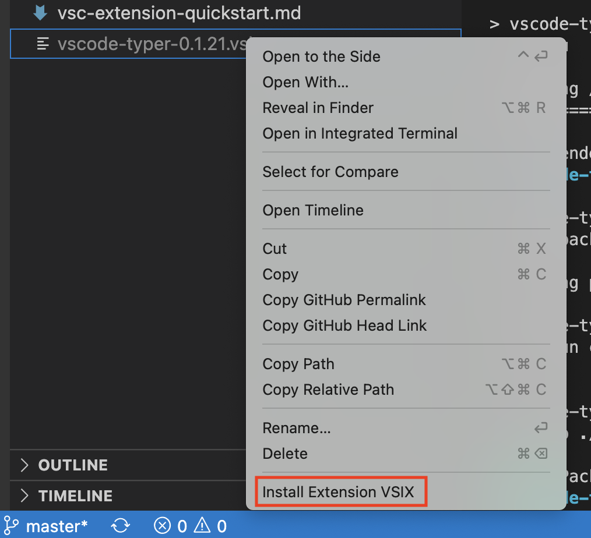

[](https://gitpod.io/#https://github.com/domesticmouse/vscode-typer) 

# VSCode Typer

Automated typing in Visual Studio Code. Great for live coding on stage =)

## Features

It types out code!

## Install

1. `$ npm install`
2. `$ npm run package`
3. Right click on the generated `vscode-typer-X.X.X.vsix` file and select "Install Extension VSIX"
   

   

## Usage

1. Create a `typer/steps.json` file with more than one step:

```javascript
[
    {
        "file": "test.js", // file  to change
        "content" : "test-2.js", // changed state
        "charsPerChange": 5 // characters per change
    }
]
```

2. Use the VS Code Typer: Reset command via CMD+Shift+P
3. Use CMD + -> / CMD  + <- to navigate between steps

Check [this Flutter repo](https://github.com/google/flutter_minimal_store) for a usage example.
